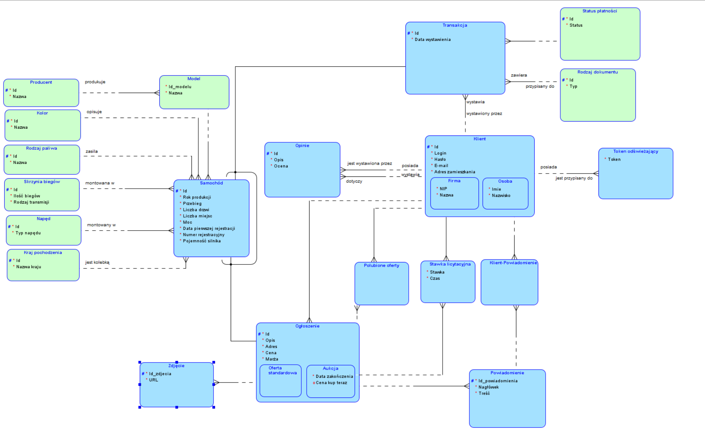

# Projekt z przedmiotu Bazy Danych 2
Damian D'Souza | Kamil Marszałek | Michał Suski | Michał Szwejk | Piotr Szkoda

# Dokumentacja Systemu Aukcji Samochodowych

1. Opracowanie modelu pojęciowego (E-R) ✅
2. Na podstawie modelu pojęciowego opracowanie relacyjnego logicznego modelu danych ✅
3. Zaprojektowanie funkcjonalności aplikacji: części operacyjnej (transakcyjnej) oraz części analityczno-raportowej ✅
4. Optymalizacja modelu logicznego (w szczególności denormalizacja) w celu maksymalizacji wydajności systemu ✅
5. Opracowanie elementów funkcjonalnych na poziomie bazy danych (triggery, procedury składowane) ✅
6. Dobór technologii bazodanowej, instalacja i konfiguracja środowiska ✅
7. Dobór technologii realizacji aplikacji, instalacja i konfiguracja środowiska rozwojowego ✅
8. Opracowanie, wdrożenie i optymalizacja modelu fizycznego ✅
9. Opracowanie scenariuszy i danych testowych ✅
10. Opracowanie dokumentacji analityczno-projektowej (w szczególności diagramów modeli danych z opisami) ✅ / ❔
11. Opracowanie dokumentacji użytkowej aplikacji ❔

## Spis Treści
1. [Przegląd Systemu](#przegląd-systemu)
2. [Architektura Systemu](#architektura-systemu)
3. [Stos Technologiczny](#stos-technologiczny)
4. [Projekt Bazy Danych](#projekt-bazy-danych)
5. [Backend](#backend)
6. [Frontend](#frontend)
7. [Dokumentacja API](#dokumentacja-api)
8. [Funkcje Real-time](#funkcje-real-time)

## Przegląd Systemu

Aplikacja ta umożliwia użytkownikom rejestrację, tworzenie i zarządzanie ofertami sprzedaży samochodów, uczestnictwo w aukcjach oraz kupno pojazdu.

### Kluczowe Funkcje

- **Katalog Samochodów**: Kompleksowa baza danych samochodów z producentami, modelami i szczegółowymi specyfikacjami
- **System Aukcji**: Licytowanie w czasie rzeczywistym
- **Oferty Sprzedaży**: Sprzedawcy mogą tworzyć i zarządzać ogłoszeniami sprzedaży samochodów
- **Zarządzanie Obrazami**: Przechowywanie i zarządzanie zdjęciami samochodów w chmurze
- **Powiadomienia w czasie rzeczywistym**: Aktualizacje w czasie rzeczywistym dla ofert i wydarzeń aukcyjnych oparte na WebSocket
- **Wyszukiwanie i Filtrowanie**: Zaawansowane możliwości wyszukiwania samochodów i aukcji


## Architektura Systemu

```
┌─────────────────┐    ┌─────────────────┐    ┌─────────────────┐
│   Frontend      │    │    Backend      │    │   Baza Danych   │
│   (Next.js)     │◄──►│   (Go/Gin)      │◄──►│  (PostgreSQL)   │
└─────────────────┘    └─────────────────┘    └─────────────────┘
                              │
                              ▼
                       ┌─────────────────┐
                       │     Redis       │
                       │(Message Broker) │
                       └─────────────────┘
                              │
                              ▼
                       ┌─────────────────┐
                       │   Cloudinary    │
                       │ (Image Storage) │
                       └─────────────────┘
```

### Zasady Architektury

- **Modularność**: Podział na domeny i moduły dla lepszej organizacji kodu
- **RESTful API**: Standardowe endpointy REST z kompleksową dokumentacją Swagger
- **Komunikacja czasu rzeczywistego**: Integracja WebSocket dla aktualizacji na żywo
- **Broker wiadomości**: Redis do przesyłania wiadomości
- **Cloud Storage**: Zewnętrzne przechowywanie obrazów dla skalowalności
- **Deployment Oparty na Kontenerach**: Konteneryzacja dla spójnych środowisk

## Stos Technologiczny

### Technologie Backendowe
- **Go 1.21+**: Główny język backendowy
- **Gin Framework**: Framework webowy HTTP dla Go
- **GORM**: Biblioteka object-relational mapping
- **Redis**: Broker wiadomości
- **JWT**: JSON Web Tokens do uwierzytelniania
- **WebSocket**: Komunikacja real-time przez gorilla/websocket
- **Swagger**: Dokumentacja API z gin-swagger
- **Cloudinary**: Przechowywanie obrazów w chmurze
- **bcrypt**: Hashowanie haseł

### Technologie Frontendowe
- **Next.js 14**: Framework React z App Router
- **TypeScript**: Type-safe JavaScript
- **React 18**: Biblioteka UI z najnowszymi funkcjami
- **NextAuth.js**: Framework uwierzytelniania
- **TailwindCSS**: Utility-first CSS framework

### Technologie Bazodanowe
- **PostgreSQL 15+**: Główna baza danych
- **pg_ivm**: Rozszerzenie Incremental View Maintenance
- **Custom Triggers**: Logika biznesowa na poziomie bazy danych
- **Widoki**: Materialized views dla optymalizacji zapytań

### DevOps i Deployment
- **Docker**: Platforma konteneryzacji
- **Git**: System kontroli wersji

## Projekt Bazy Danych

Baza danych zaprojektowana z wykorzystaniem PostgreSQL, z uwzględnieniem zasad normalizacji i integralności danych.

### Struktura Plików Bazy Danych

```
database/
├── schema.sql          # Podstawowe definicje tabel i typów danych
├── triggers.sql        # Triggery bazy danych dla logiki biznesowej
├── init-pg-ivm.sql     # Materialized views z rozszerzeniem pg_ivm
├── init-test-db.sql    # Inicjalizacja testowej bazy danych
└── Dockerfile          # Konfiguracja kontenera bazy danych
```




### Typy Danych i Enumy

Baza danych używa niestandardowych enumów PostgreSQL dla bezpieczeństwa typów:

- **SELECTOR**: Typ użytkownika (`'P'` dla Osoby, `'C'` dla Firmy)
- **OFFER_STATUS**: Stany ofert sprzedaży (`'pending'`, `'ready'`, `'published'`, `'sold'`, `'expired'`)
- **COLOR**: Kolory samochodów (20 predefiniowanych kolorów plus `'other'`)
- **FUEL_TYPE**: Typy paliwa silnika (`'diesel'`, `'petrol'`, `'electric'`, `'hybrid'`, itp.)
- **TRANSMISSION**: Typy skrzyni biegów (`'manual'`, `'automatic'`, `'cvt'`, `'dual_clutch'`)
- **DRIVE**: Systemy napędu (`'fwd'`, `'rwd'`, `'awd'`)
- **DOCUMENT_TYPE**: Klasyfikacje plików (`'invoice'`, `'receipt'`, `'other'`)

### Zaawansowane Funkcje Bazy Danych

#### Triggery (triggers.sql)
- **Trigger Tworzenia Aukcji**: Automatycznie ustawia `is_auction = TRUE` kiedy rekord aukcji jest tworzony
- **Trigger Usuwania Użytkownika**: Czyści niesprzedane oferty gdy użytkownik jest usuwany

#### Materialized Views (init-pg-ivm.sql)
- **offer_creators**: Szybkie wyszukiwanie twórców ofert
- **offer_bidders**: Aktywni licytujący w opublikowanych aukcjach
- **offer_likers**: Użytkownicy, którzy polubili opublikowane oferty
- **user_offer_interactions**: Unia wszystkich relacji użytkownik-oferta
- **regular_sale_offer_view**: Kompleksowy widok ofert nie-aukcyjnych
- **auction_sale_offer_view**: Kompleksowy widok ofert aukcyjnych
- **sale_offer_view**: Połączony widok wszystkich ofert sprzedaży ze szczegółami samochodów

#### Optymalizacje Wydajności
- **Indeksy Unikalne**: Zoptymalizowane ograniczenia na materialized views
- **Indeksy Złożone**: Indeksy wielokolumnowe dla częstych zapytań
- **Ograniczenia Foreign Key**: Integralność referencyjna z kaskadowymi usunięciami
- **Ograniczenia Check**: Walidacja danych na poziomie bazy danych

### Funkcje Integralności Danych

- **Kaskadowe Usunięcia**: Powiązane rekordy są odpowiednio czyszczone
- **Wartości Domyślne**: Soft deletion używające domyślnego użytkownika (ID: 1) dla integralności referencyjnej
- **Ograniczenia Zakresów**: Walidowane zakresy dla pól numerycznych (drzwi: 1-6, miejsca: 2-100, itp.)
- **Ograniczenia Unikalne**: Zapobieganie duplikowaniu danych gdzie wymagane
- **Ograniczenia Deferrable**: Wsparcie dla złożonych scenariuszy transakcyjnych

## Backend

Backend aplikacji jest zbudowany w Go, używając frameworka Gin i GORM do interakcji z bazą danych PostgreSQL.

### Struktura Domen

```
internal/domains/
├── auction/          # Zarządzanie aukcjami
├── auth/             # Uwierzytelnianie i autoryzacja
├── bid/              # Operacje licytowania
├── car/              # Zarządzanie katalogiem samochodów
├── generic/          # Funkcjonalności wspólne dla wszystkich domen
├── image/            # Obsługa obrazów
├── liked_offer/      # Zarządzanie polubionymi ofertami
├── manufacturer/     # Zarządzanie producentami samochodów
├── model/            # Zarządzanie modelami samochodów
├── notification/     # Powiadomienia real-time
├── purchase/         # Zarządzanie zakupami i transakcjami
├── refresh_token/    # Zarządzanie tokenami odświeżania
├── review/           # System recenzji
├── sale_offer/       # Zarządzanie ofertami sprzedaży
├── scheduler/        # Zadania zaplanowane i cykliczne
├── user/             # Zarządzanie użytkownikami
└── ws/               # Zarządzanie połączeniami WebSocket
```


### Kluczowe Komponenty

#### Warstwa Modeli
- **Modele Bazy Danych**: Definicje modeli oparte na GORM
- **Walidacja**: Walidacja i sanityzacja danych wejściowych
- **Relacje**: Złożone relacje między encjami

#### Warstwa Domeny
- **Logika Biznesowa**: Podstawowe reguły biznesowe i operacje
- **Usługi**: Implementacje usług specyficznych dla domeny
- **Repozytoria**: Abstrakcja dostępu do danych

#### Warstwa API
- **Routes**: Definicje endpointów RESTful
- **Middleware**: Uwierzytelnianie, CORS, logowanie
- **Handlers**: Przetwarzanie żądań/odpowiedzi HTTP

### Przepływ Uwierzytelniania

1. **Rejestracja**: Użytkownik tworzy konto (osoba lub firma)
2. **Logowanie**: Walidacja danych uwierzytelniających, wydanie tokenów JWT
3. **Odświeżanie Tokenów**: Automatyczne odnawianie tokenów
4. **Autoryzacja**: Kontrola dostępu do chronionych zasobów

### Funkcje Real-time

- **Połączenia WebSocket**: Trwałe połączenia dla aktualizacji na żywo
- **System Powiadomień**: Powiadomienia o ofertach w czasie rzeczywistym
- **Zarządzanie Połączeniami**: Śledzenie sesji użytkowników

## Frontend

Frontend aplikacji jest zbudowany w Next.js, wykorzystując TypeScript i TailwindCSS do tworzenia responsywnego interfejsu użytkownika.

### Struktura Aplikacji

```
app/
├── (home)/              # Strona główna aplikacji
├── login/               # Logowanie użytkowników
├── signup/              # Rejestracja nowych użytkowników
├── account/             # Zarządzanie kontem użytkownika
│   ├── activity/        # Historia aktywności użytkownika
│   ├── favorites/       # Polubione oferty
│   ├── listings/        # Ogłoszenia użytkownika
│   ├── notifications/   # Powiadomienia
│   ├── reviews/         # Recenzje i opinie
│   └── settings/        # Ustawienia profilu
├── offer/               # Zarządzanie ofertami sprzedaży
│   ├── add/             # Dodawanie nowych ofert
│   └── [id]/            # Szczegóły konkretnej oferty
├── seller/              # Profile sprzedawców
│   └── [sellerId]/      # Profil konkretnego sprzedawcy
├── actions/             # Server Actions dla Next.js
├── api/                 # API Routes (handlery route API)
├── lib/                 # Biblioteki i utilities
├── test/                # Komponenty testowe
└── ui/                  # Komponenty interfejsu użytkownika
```

### Kluczowe Funkcje

#### Integracja Uwierzytelniania
- **NextAuth.js**: Bezpieczne uwierzytelnianie z JWT
- **Zarządzanie Sesjami**: Automatyczne odświeżanie tokenów
- **Ochrona Route**: Kontrola dostępu oparta na middleware

#### Interfejs Użytkownika
- **Biblioteka Komponentów**: Komponenty UI wielokrotnego użytku
- **Obsługa Formularzy**: Type-safe walidacja formularzy
- **Upload Obrazów**: Integracja z Cloudinary

#### Zarządzanie Stanem
- **Server Components**: Zoptymalizowane pobieranie danych
- **Client Components**: Interaktywne elementy UI
- **Integracja API**: Klient HTTP oparty na Axios


## Dokumentacja API

### Główne Endpointy


#### Uwierzytelnianie
```
POST /auth/register          - Rejestracja użytkownika
POST /auth/login             - Uwierzytelnianie użytkownika
POST /auth/refresh           - Odświeżanie tokenów
PUT  /auth/change-password   - Zmiana hasła
POST /logout                 - Wylogowanie użytkownika
```

#### Zarządzanie Użytkownikami
```
GET    /users/              - Lista wszystkich użytkowników
PUT    /users/              - Aktualizacja profilu użytkownika
GET    /users/id/{id}       - Pobranie użytkownika po ID
GET    /users/email/{email} - Pobranie użytkownika po emailu
DELETE /users/{id}          - Usunięcie użytkownika
```

#### Oferty Sprzedaży
```
POST /sale-offer/                  - Tworzenie oferty sprzedaży
PUT  /sale-offer/                  - Aktualizacja oferty sprzedaży
PUT  /sale-offer/publish/{id}      - Publikacja oferty sprzedaży
POST /sale-offer/filtered          - Filtrowanie ofert sprzedaży
POST /sale-offer/my-offers         - Moje oferty sprzedaży
POST /sale-offer/liked-offers      - Polubione oferty
GET  /sale-offer/id/{id}           - Szczegóły oferty po ID
GET  /sale-offer/offer-types       - Typy ofert
GET  /sale-offer/order-keys        - Klucze sortowania
POST /sale-offer/buy/{id}          - Kup teraz
```

#### Aukcje
```
POST /auction/              - Tworzenie aukcji
PUT  /auction/              - Aktualizacja aukcji
POST /auction/buy-now/{id}  - Kup teraz w aukcji
```

#### Licytowanie
```
POST /bid/                                              - Złożenie oferty
GET  /bid/                                              - Lista wszystkich ofert
GET  /bid/{id}                                          - Szczegóły oferty po ID
GET  /bid/bidder/{id}                                   - Oferty po ID licytującego
GET  /bid/auction/{id}                                  - Oferty w aukcji
GET  /bid/highest/{id}                                  - Najwyższa oferta
GET  /bid/highest/auction/{auctionID}/bidder/{bidderID} - Najwyższa oferta użytkownika
```


### Funkcje API

- **Dokumentacja Swagger**: Interaktywny eksplorator API pod `/swagger/`
- **Modele Request/Response**: Kompleksowe schematy danych
- **Obsługa Błędów**: Standaryzowane odpowiedzi błędów
- **Paginacja**: Paginacja oparta na kursorze dla dużych zbiorów danych
- **Filtrowanie**: Zaawansowane parametry zapytań do filtrowania danych
- **Sortowanie**: Elastyczne opcje sortowania

## Funkcje Real-time

### Implementacja WebSocket

System implementuje funkcje real-time używając połączeń WebSocket:

#### Typy Wydarzeń

```json
{
  "type": "bid_placed",
  "auction_id": "123",
  "bid_amount": 25000,
  "bidder": "user456",
  "timestamp": "2024-01-15T10:30:00Z"
}
```

```json
{
  "type": "auction_ended",
  "auction_id": "123",
  "winning_bid": 30000,
  "winner": "user789",
  "timestamp": "2024-01-15T11:00:00Z"
}
```
